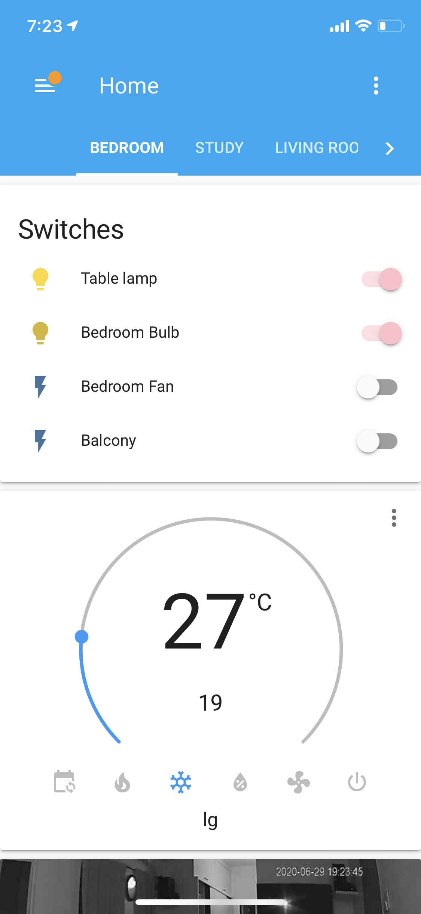
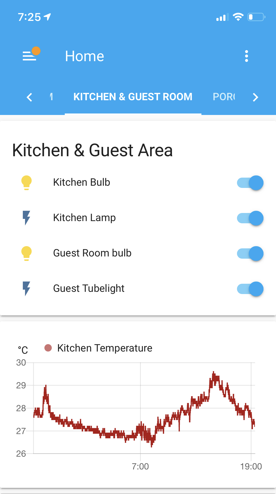
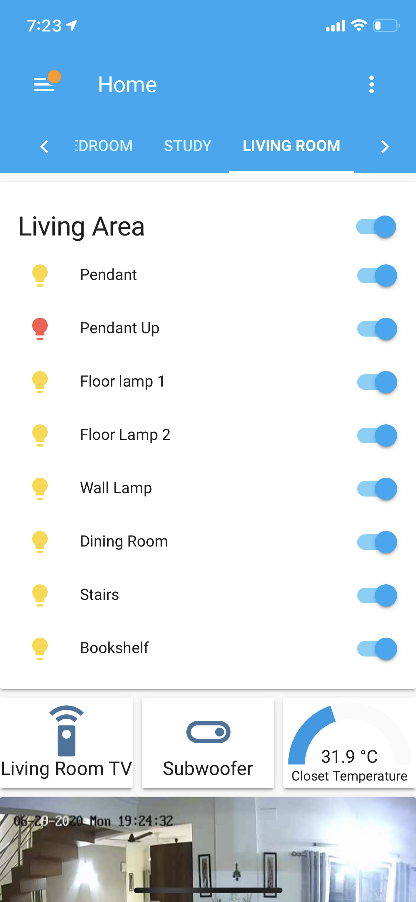
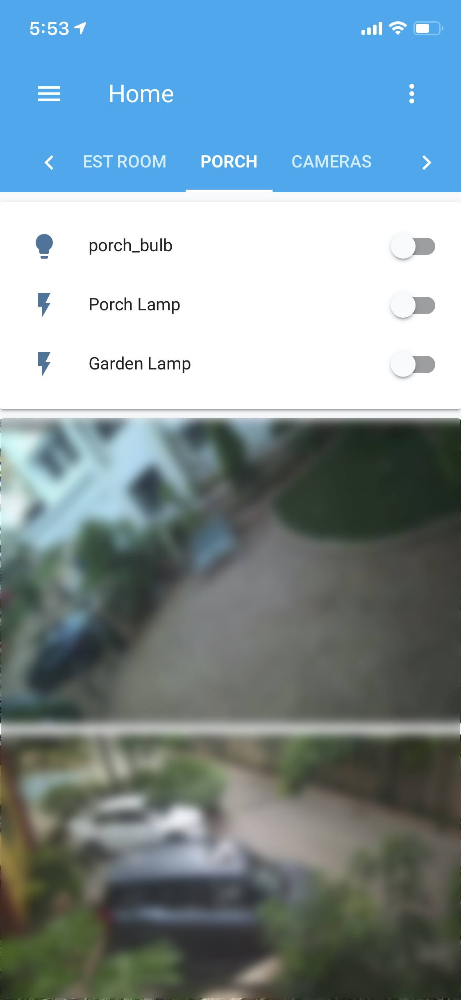
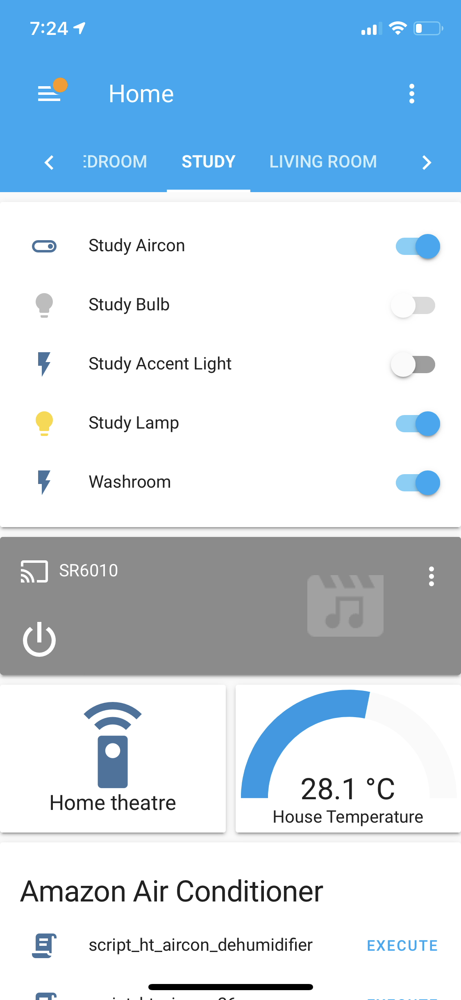
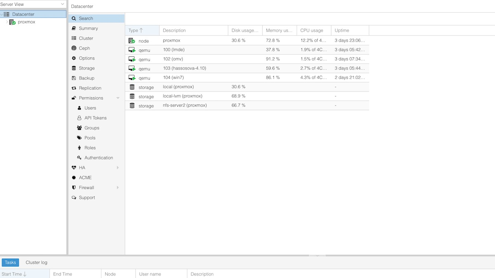
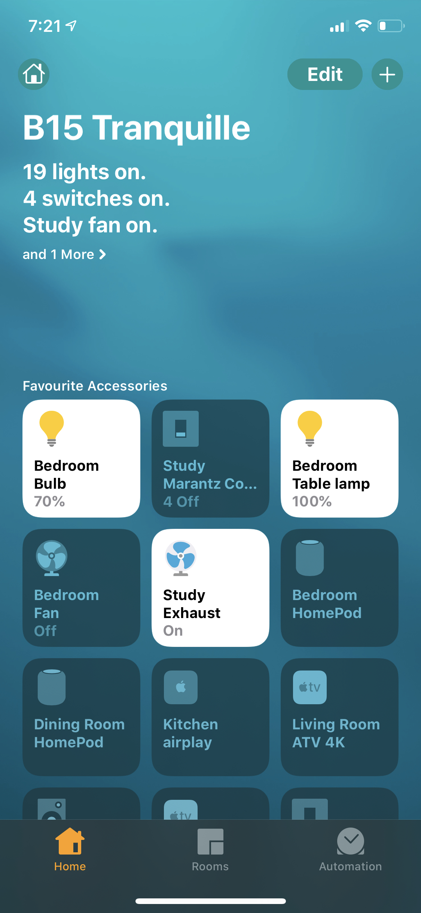
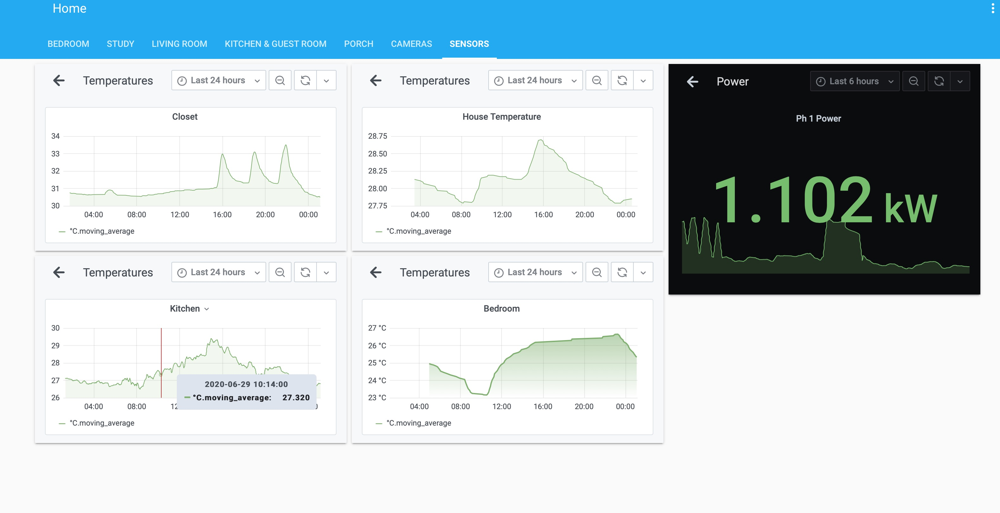

# Home Assistant

A running summary of my system migration from Domoticz to Home-Assistant. I put a domoticz server in production back in 2013 but migrating over to HA over the last few weeks.

The long term plan is to have HA do all of the heavy lifting but to keep domoticz running primarily for sensors and logging.

19th June – First Install
All configuration available in config.yaml and other files

- [Home Assistant](#home-assistant)
- [Background](#background)
- [Equipment](#equipment)
  * [Servers](#servers)
  * [Network](#network)
    + [Router](#router)
    + [Access Points](#access-points)
    + [Switches](#switches)
  * [Voice Control/ Smart Speaker](#voice-control--smart-speaker)
  * [Lights](#lights)
  * [Switches](#switches-1)
  * [Hubs](#hubs)
  * [Media Players and multi-room audio](#media-players-and-multi-room-audio)
  * [Sensors](#sensors)
    + [Temperature and Humidity](#temperature-and-humidity)
    + [Smoke / Fire/ Carbon Monoxide](#smoke---fire--carbon-monoxide)
    + [Power Monitoring](#power-monitoring)
  * [Remote Control](#remote-control)
  * [Cameras &amp; Security](#cameras--amp--security)
      - [Lock](#lock)
      - [Camera](#camera)
      - [Doorbell](#doorbell)
  * [Logging and Graphing](#logging-and-graphing)
  * [Other bridges on the network](#other-bridges-on-the-network)
    + [HABRIDGE](#habridge)
    + [Homebridge](#homebridge)
    + [APC UPS](#Apcupsd)

<small><i><a href='http://ecotrust-canada.github.io/markdown-toc/'>Table of contents generated with markdown-toc</a></i></small>

# Background

I started setting up my first home automation back in 2013 after I spotted a deal on a pair of wemo plug/ sensor in a B&amp;M store while on a holiday in London. Coincidentally, we also brought our first house a few months later so that&#39;s what triggered ~~hobby~~ slide down a rabbithole.

Back then, IoT and home automation was not really a thing in India and Amazon India hasn&#39;t even launched (which I guess is my primary source for all equipment now.) Nonetheless, there was eBay and I was able to (very slowly) add equipment through super snail mail parcels from aliexpress/ ebay and / or items picked on overseas trips.

The current situation now is of course very different.

I started off with Domoticz, a platform that I still dig! It has served me extremely well for close to 7 years. I dabbled with HA and openhab once or twice in the interim but was turned off by yaml and its super finicky indentation.

Unfortunately the third party dev scene for domoticz is nearly non-existent now and native integration for devices is quite limited. I am not a software guy/ coder but had somehow managed to patch together several working scripts and plugins to make the whole thing work somehow. I guess the last straw for me was when an accidental update earlier this month broke my working system and restoration took a day and more because of all the a-la-carte scripts and binaries I had on my system.

I installed HA as a guest on a KVM (proxmox) about 2 weeks ago and the initial issues of getting familiarized with yaml, it&#39;s been pretty smooth going. I still feel that there is room for optimization, especially for some simple/basic things like adding virtual switches (easily) or maintaining downsampled longer term records (both of which domoticz does exceptionally well) but all said, I am glad I switched.

.  .  . .  

Here is my configuration details and files in case it helps someone get started.

# Equipment

## Servers

- Proxmox hypervisor running 4 VMs (i5-4130 , 12GB RAM, 120GB SSD, 4TB HDD)
  - Home-Assistant
  - HAbridge running on an existing openmediavault VM
- Domoticz running on a RPi2

## Network

The network setup is slightly convoluted as my primary ISP uses CGNAT. The primary is a 100mbps fiber connection while the secondary is a Point-to-point wifi link with my housing community wireless distribution system (50mbps fiber)

While my primary ISP is fairly reliable , they unfortunately use CGNAT. For external access, I have setup an Amazon Lightsail VPN that a linux box on the network openvpn connects to. Both the lightsail server and the linux system have appropriate port forwarding rules configured. if I access my lightsail server externally, all traffic is routed transparently to the right device on my home network

### Router

Edgerouter X (ER-X) in load balancing mode

### Access Points

Orbi RBR50, Orbi RBK 50, Orbi RBS20. The former 2 cover 1 floor each and the RBS20 covers the frontyard.

My house gets frequent short brownouts and the Orbi system does not take handle power outage very well. They are all powered by 12V 7AH batteries charging with a constant float of 12.4V

### Switches

A mix of multiple partially daisy-chained switches. The loadbalanced WAN from ER-X goes to the switch br0 on the RBR50 that then goes to 4 switches in different parts of the house (switch 3 and 4 are daisychained)

Someday I will clean this up, for now, the re-cabling does not seem to be worth the effort

## Voice Control/ Smart Speaker

1. **Echo** – 6 devices, 2 X Echo Original, 2X Echo Dot, 1 X Echo Show, 1 X Echo Spot – Linked via habridge
2. **Homepod** – 2 devices – Linked via HA native homekit integration
3. **Google Nest hub** – I had picked this on whim but turns out I don&#39;t like the cloud only model used by Google . It&#39;s unreliable and slow. Not integrated and left stand-alone

## Lights

1. **LIFX** : 5 entities that use the HA native LIFX integration
2. **Hue** : 10 entities that use the HA native LIFX integration
3. **ESP8266** – 1 ESP8266 based light bulb that was flashed to Tasmota and uses the mqtt integration. Plan to get 6 more of these
4. **Yeelight** : 1 bulb that uses the yeelight LAN control integration

Notes:

1. The LIFX bulbs are very bright and color control is very accurate. Unfortunately their wi-fi connection is flakey and requires a restart every now &amp; then. Cannot recommend them anymore
2. The Hue bulbs are amazingly stable. They have been running stable for years with no flakiness whatsoever. Maybe it&#39;s because they use zigbee. Unfortunately they are not bright enough (at most comparable to a 60W incandescent) and I would have hoped for brighter output given the price
3. **ESP8266 Tasmota** : My current favorite. The only issue is that finding the right one is a bit of a hit&amp; miss. Most lights available on Amazon India (or elsewhere) are based on generic Tuya/ Smartlife firmware .
  - Now one can use the Tuya/smartlife integration directly on HA but using the MQTT integration is a lot more reliable
  - Unfortunately the internal hardware on these bulbs could be anything. Since you can&#39;t really open these lightbulbs to get access to the serial ports, you need to make sure that you are getting one which is based on the ESP8266
  - Amazon India sells ESP8266 bulbs under their housebrand Solimo. They are easily flashed to Tasmota with tuya-convert
  - The 12W variant is plenty bright – equivalent to a 100W incandescent
4. Yeelight: Good &amp; reliable with LAN control. Slightly pricier than the Tuya

## Switches

1. Wemo: The device that got this hobby started.. The plug still works and is setup with my garden floodlight using the HA native Wemo integration
2. Sonoff/ Smartlife devices flashed to ESP8266 TASMOTA: 7 devices. 5 work as normal switches while 2 need a special mention
  - 1 X 2 wired to cooling fans for my 2 AV Receiver. They are linked to automation to switch them on if the respective AV receiver changes state to On and vice-versa

## Hubs

1. **Smartthings** : Was used extensively at one point in time. Currently in use for 5X Z-wave smoke alarms . Not integrated into HA as no real need for integration
2. **Hue Hub**
3. **Yale wifi bridge** : Used for the main door lock (YDM7116) . Unfortunately no documentation on API available. Wireshark capture didn&#39;t yield anything of value in the first pass. Currently in use as a standalone bridge with its own phone app. Need to get down to solving for this integration at some point in time.

## Media Players and multi-room audio

1. Denon X3500 – Shows up in HA with no fuss. Also used for driving the exhaust automation .
2. Marantz SR6010 - Shows up in HA with no fuss. Also used for driving the exhaust automation . On a side note, the cooling automation is quite important for me as both the AVRs are housed in closets and the closet temperatures shoot up drastically if the exhaust fan is not activated (more details in sensors)
3. DTS Play-fi – Not integrated into HA , need to figure this out
  1. 2 X Klipsch Gate – Frontyard and Guest room speakers
  2. 1 X Paradigm PW Link – Kitchen Speakers
  3. 1X Paradign PW Amp – Bedroom Speakers
  4. Homepods

## Sensors

### Temperature and Humidity

1. DS18B20 – 3 units with a One wire link to Domoticz RPi GPIO. Integrated to HA with Rest calls to domoticz
2. BMP085 – 1 unit connected to Domoticz GPIO. Integrated to HA with Rest calls to domoticz
3. ESP8266 Tasmota – 2 unit with a DHT sensor sending MQTT data to domoticz – This is used to monitor AV Receiver closets

### Smoke / Fire/ Carbon Monoxide

1. 5X Z-wave First Alert CO/ Smoke Sensors – Linked to Smartthings and not integrated with HA or domoticz. May do it someday but not a priority

### Power Monitoring

1. [Mysensors](https://www.mysensors.org/build/connect_radio) SCT013, Arduino and nrf – Retired last week. While it worked for almost 5 years, the wireless connection was unreliable and the SCT-013 is not very precise
2. PZEM004T and ESP8266 – Uses [arendst/tasmota](https://tasmota.github.io/docs/PZEM-0XX/)

Notes : I have a 3 phase supply and the older SCT013 used a CT sensor on the neutral phase at the distribution box to return a consolidated reading for all phases.

My plan was to wire the PZEM004T in the same way but realized that the readings were off because the PZEM004T power factor calculation would be off due to the phase difference .

Now I have ordered 2 more pairs to have 3 separate sensor reading for each phase that can be combined later on in Grafana

## Remote Control

1. 2X Harmony hub – 1 for living room TV, audio and HVAC, 1 for Home Theater projector, Audio and HVAC, integrated via native HA harmony integration
2. 1 X ESP8266 Tasmota IR – Based on a Oakter remote flashed to run Tasmota IR. The HVAC control required a custom integration called [tasmota\_ihvac](https://www.home-assistant.io/integrations/tasmota_irhvac)

## Cameras &amp; Security

#### Lock

1. Rear Door: Kwikset Z-wave lever lock – Integrated with Smartthings but not with HA. Should be easy but I cannot think of a use-case
2. Main Door: Yale YDM7116 – This one is an oddball. The lock uses a BT module that is used for phones in proximity. Additionally, it uses a wifi-BT bridge called the yale link bridge that enables remote connectivity.

Notes: The Kwikset Z\_wave is very flakey. It intermittently Lost connection with the ST hub – and worse, each time that happens, it results In its battery getting drained – presumably because it keeps searching for the hub. In addition, the lock hardware is quite flimsy. Cannot recommend this at all – Also the reason I purchased the Yale and moved this to the rear door.

In contrast, the yale build quality is massively better and the connection is super reliable. Unfortunately there is no documentation available on the Yale link bridge, nor can I find much info on the interwebs either

#### Camera

I use a mix of 7 cameras from Foscam and Hikvision all wired to a Hikvision NVR. I initially enabled rtsp streaming but later switched to static images instead for faster renders on lovelace. The rationale being I can always use the Hikvision app if I need to view the actual stream.

#### Doorbell

Ring Video Doorbell (the basic variant) – Integrated via HA Ring native. Automation to flash a couple of lights when someone rings the bell.

## Logging and Graphing

Now I really wish HA had native logging support for long term data, esp for sensors as I am sure this would be a very common use case.

As things stand, I have configured an influxdb installation on another VM coupled with the Grafana plugin. It was a somewhat steep learning curve and I guess I am using these two tools to only 5% of their capability but for now, this will do.

As it&#39;s been only a few days of using influx, I have not yet got down to setting up downsampling sensor data but I guess I will want to get it done with before a month or so.

Here is a sample grab from domoticz that shows how downsampling is handled on it.

## Other bridges/ Misc

### HABRIDGE

Used for Alexa integration. I really cannot say enough good things about [habridge](https://github.com/bwssytems/ha-bridge).

Setup and installation is trivial on any linux box. Configuring it for domoticz or HA is extremely user friendly and intuituive. Once configured, it is also very reliable. This has historically been the primary method of interacting with devices in my household by everyone .

If you have not used habridge, I really recommend you do try it once.

### Homebridge

Was used extensively for [homekit](https://github.com/homebridge/homebridge) integration over the last few years. I have for now disabled this as I play around with the native homekit integration on HA

### Apcupsd

Not really a bridge but the apcupsd integration on ha allows me to keep an eye on the UPS that powers the hypervisor plus allows a clean shutdown in case there is a long power failure

